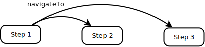
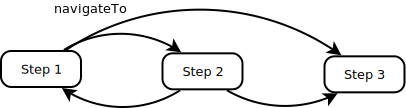

# Documentation

1. [Design](#design)
1. [States](#states)
1. [Transition Definitions](#transitions)
1. [Guards](#guards)
1. [API](http://ea-state-machine.eascientific.com/)

## <a name="design">Design</a>

`ea-state-machine` can be used to model any type of state machine, but the main goal is to provide a general abstraction for User/UI navigation in front-end appslications, that can be used across different UI frameworks.

> "Write your routing logic once, run it everywhere!"

Most `routing` libraries in have notions of state machines, but are often incomplete or are using a wrong abstraction. 
Examples: A `route` is not a real route from `A` to `B`, but rather a `page`, which is better modeled as a `state`. Once you realize that, you can model "real" routes as a transition from one state to the other, which allows you to execute business logic when a user navigates from one page to another. 

Guards on transitions allow to control the flow of a user with a centralzed set of business rules.

One reason that current routing libraries are not fully supporting a state machine model, is that users, in the most common case, are allowed to navigate anywhere. Defining all those transitions is tedious and hence are not being considered. Guards are not on the transition, but more an entry condition to a page (e.g. [IsAuthorized]).

This library addresses this shortcomming with the concept of `Transition Definitions`. `Transition Definitions` allow for the simple common case as well extending your page navigation with complex flow rules.
Using this abstation of this library allows to move this logic from an older framework to a new one, or even use it it different environments like native apps. 

## <a name="states">States</a>


An `ea-state-machine` consists of a finite set of states, e.g:

- solid
- liquid
- gas

and a set of Transition Definitions:

- melt
- vaporize
- condense
- freeze

The system can only be in one state at a time and can only move from one state to the other, if there is a definded transition connecting the two states.

States have data associated, some of which is maintained by `ea-state-machine` and other can be provided by the user.

```js
const state = {
  solid: {
    name: 'Ice',
    count: 3, // count how often this state has been visited, user can provide initial value (default: 0)
    valid: false, // indicating whether state is valid, can be used by guards (default: false)
    order: 1, // used for sorting states
    data: {}, // contains any data provided by user for this state (default: {})
    onEnter: () => { // optional: function executed when entering this state
      console.log('entering Ice state ...')
    },
    onExit: () => { // optional: function executed when exiting this state
      console.log('exiting Ice state ...')
    }
  },
  ...
}

```

## <a name="transitions">Transition Definitions</a>

A transition definition is a directed connection between one or many states.



```js
const state = {
  step1: { name: 'Step 1' },
  step2: { name: 'Step 2' },
  step3: { name: 'Step 3' }
}

const transitionDefinition = {
  navigateTo: {
      from: () => [state.step1],
      to: () => [state.step2, state.step3],
      action: (transition) => {
        console.log('currently in: ', transition.fsm.currentState.name)
        console.log('navigating to ', transition.toState.name)
      }
  }
}
```
`fsm.currentTransitions` is a collection of all possible transitions that can be conducted. This can also be subscribed to using `rxjs`.

```js
fsm.possibleTransitionInstances$
  .subscribe(t => {
    console.log(`Transition From: ${t.from.name} -> To: ${t.to.name}`)
  })
```
Output:
```shell
Transition From: Step 1 -> To: Step 2
Transition From: Step 1 -> To: Step 3
```
In this case, `Step 2` and `Step 3` are end states. Adding `state2` to `from` allows to continue to navigate to Step 1 and 3.



```js
const transitionDefinition = {
  navigateTo: {
      from: () => [state.step1, state.step2],
      to: () => [state.step2, state.step3],
// ...
```
Allowing to navigate from any state to any state is easy too:
```js
const transitionDefinition = {
  navigateTo: {
      from: (fsm) => [fsm.currentState],
      to: (fsm) => [fsm.states],
// ...
```
## <a name="guards">Guards</a>

Guards prevent transitions within a state-machine. They enable a rule-based approach to state transitions. Returning false prevents a transition. If `true`, `undefinded`, or `null` are returned, a transition is possible.

```javascript
const guard = {
  canMelt: (fsm, from, to) => fsm.data.temperature > 0
}
```
Multiple guards can be assigned to transition definitions or to states. Guards definded on states are for any trasition coming in or out of that state.
