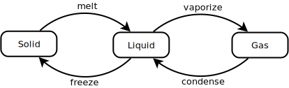

[TOC]

# States

<p align="center">
  
</p>

A `ea-state-machine` consists of a finite set of states, e.g:

- solid
- liquid
- gas

and a set of Transition Definitions:

- melt
- vaporize
- condense
- freeze

The system can only be in one state at a time and can only move from one state to the other, if there is a definded transition connecting the two states.

States have data associated, some of which is maintained by `ea-state-machine` and other can be provided by the user.

```js
const state = {
  solid: {
    name: 'Ice',
    count: 3, // count how often this state has been visited, user can provide initial value (default: 0)
    valid: false, // indicating whether state is valid, can be used by guards (default: false)
    data: {}, // contains any data provided by user for this state (default: {})
    onEnter: () => { // optional: function executed when entering this state
      console.log('entering Ice state ...')
    },
    onExit: () => { // optional: function executed when exiting this state
      console.log('exiting Ice state ...')
    }
  },
  ...
}

```

# Transition Definitions


